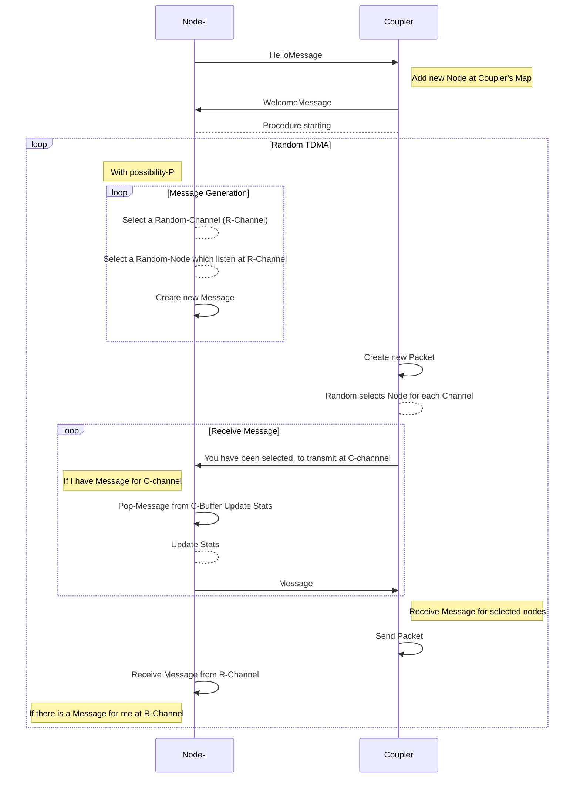

# Random TDMA

This repository implements the suggested algorithm-3 of the papper [1], which refers to a Random TDMA algorithm. In the context of this algorithm a passive star (coupler) system simulator was developed, so that it could be easy to modify the routing algorithm and simulate any of available algorithms that can apply at architecture of a Passive Star.

### Sequence Diagram of Code Execution

### Results

#### Bibliography

[1] Ganz, A. and Koren, Z., 1991, January. WDM passive star-protocols and performance analysis. In *IEEE INFCOM'91-Communications Societies Proceedings* (pp. 991-992). IEEE Computer Society.
